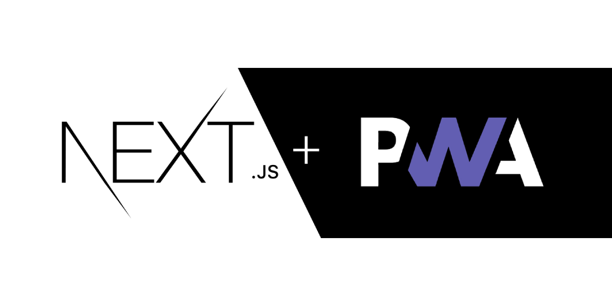

#

<h1>Next.js 13 + PWA   

Usando Next.js 13 com PWA

</h1>

## Descrição

[Ver Projeto](https://next13-with-pwa.vercel.app/)

#### Criando um App simples com Next.js 13.4 com PWA

#

#

<!-- ## _Layout Mobile_

# -->

<!-- ## _Layout Web_ -->

<!-- 
#

#

# -->

## 🛠️ Tecnologias

💻 **Front-end**
- [Next.js 13.4](https://nextjs.org)
- [TypeScript](https://www.typescriptlang.org)

📚 **Bibliotecas**
- [next-pwa](https://www.npmjs.com/package/next-pwa)

🎨 **Estilização**
- [tailwindcss](https://tailwindcss.com/docs/installation)

🔋 **Versionamento e Deploy**
- [Git](https://git-scm.com)
- [Vercel](https://vercel.com/)

 

⚙️ **Configuranções e Instalações**

Clone do Projeto

    $ git clone https://github.com/renovatt/next13-with-pwa.git

Instalando as dependências

    $ npm install

Iniciando o projeto

    $ npm run dev

 

**Como contribuir?**

- Você pode dar suporte me seguindo aqui no GitHub
- Dando uma estrela no projeto
- Criar uma conexão comigo no linkedin fazendo parte da minha networking e curtir o meu projeto.

 

**Autor**
[Wildemberg Renovato de Lima](https://www.linkedin.com/in/renovatt/)